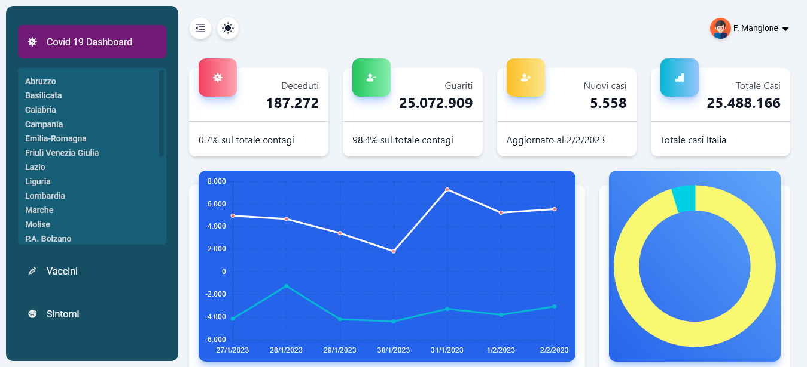
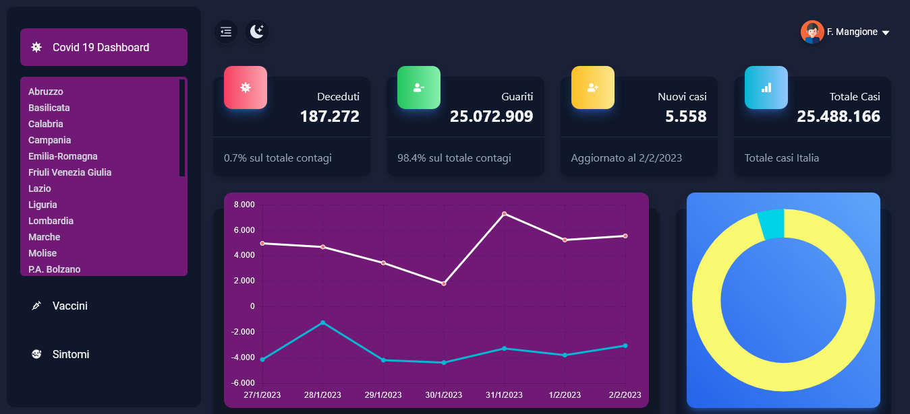

### Covid 19 Dasboard</br>

A very usefull app where to see data about covid 19 and vaccines situation in Italy.

## Table of Contents

[General info](#general-info)</br>
[Technologies](#technologies)</br>
[Setup](#setup)</br>

### General info

This app fetch data from two free api (see links at the end) with loader from react-router-dom, and then display it in home page, regions and Italy pages, vaccines page and sintoms.

- A home page covid 19 data.
- A vaccines page.
- A sintoms page.
- Tables and charts for every data
- I have even implemented dark mode function for all app.




### Technologies

- [React](https://it.reactjs.org/)
- [Javascript](https://developer.mozilla.org/en-US/docs/Web/JavaScript?retiredLocale=it)
- [Webpack 5](https://webpack.js.org/blog/2020-10-10-webpack-5-release/)
- [Axios](https://github.com/axios/axios)
- [Tailwind](https://tailwindcss.com/)
- [React Icons](https://react-icons.github.io/react-icons/)
- [React Router](https://reactrouter.com/en/main)
- [UUID](https://www.npmjs.com/package/uuid)
- [react-countup](https://www.npmjs.com/package/react-countup)
- [react-chartjs-2](https://react-chartjs-2.js.org/)
- [chart.js](https://www.chartjs.org/)

### Setup

Download [Node](https://nodejs.org/en/) and installed it on your operating system like windows or mac.

1. Clone the repository on local server:

   ```sh
   git clone https://github.com/francescoup/
   ```

2. Install NPM packages:

   ```sh
   npm install
   ```

3. Build from source:

   ```sh
   npm run build
   ```

4. Run the live server:
   git
   ```sh
   npm run start
   ```

   ```

## License

Distributed under the MIT License.

## Links

You can see the app at the following link:

Live Site: [Covid 19 Dashboard](https://dashboard-covid-italy.netlify.app/)</br>
Covid data API : [Covid 19](https://github.com/pcm-dpc/COVID-19)<br>
Vaccines data API [Open data Vaccines](https://github.com/italia/covid19-opendata-vaccini)
